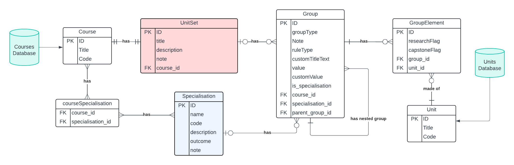

# CITS5206-Team16-UnitSetBuilder

Information Technology Capstone Project - Unit Set Builder - Team 16

### Application Objective

The Unit Set Builder aims to address the challenges faced by our client, whose current system is outdated and cumbersome to use. This application streamlines the management of course structures, enhancing the efficiency of daily operations. Key features of the Unit Set Builder include:

- Login/Logout into website
- Search courses
- Create and manage course structure (known as Unit Set)
- Create reusable specialisation where can be used by multiple courses
- Drag and Drop to manage the sturcuture of the course

### Set up application locally

**1. Git Clone**

Using the HTTPS link retrieved from the project GitHub repository and run the following command in Terminal to clone project source code to your server or your local host machine.

```bash
git clone https://github.com/TonyyZzz/CITS5206-Team16-UnitSetBuilder.git
```

**2.Create python virtual environment**

```bash
Python -m venv venv #Create new virtual env
source venv/bin/activate # activate virtual env
```

**3. Activate virutal environemnt**

**macOS/Linux**
```bash
source venv/bin/activate

```
**Windows**
```bash
.\venv\Scripts\activate
```

**3. Install Required Packages**
```bash
pip install -r requirements.txt
```

**4. Set up app configurations**
```bash
echo FLASK_APP=app:create_app\(\"development\"\) > .env
echo FLASK_ENV=development >> .env
```

**5. Initialize and Migrate database**
```bash
flask db init
flask db migrate -m "init"
flask db upgrade
```

**6. Load existing data**
```bash
flask loaddata
```

**7. Launch Application**
```bash
flask run
```

**Enjoy the application!**

### Deployment

The application is currently deployed using `Heroku`. To access the deployed website with this [link](https://unitsetbuilder-a33e3d2c8e96.herokuapp.com/). The detailed deployment steps refer to [User Manual](https://github.com/TonyyZzz/CITS5206-Team16-UnitSetBuilder/blob/main/deliverables/User_Manual.pdf).

### Data Structure



#### Entities:

**Course**: Represents the overall course or degree program. It serves as the top-level entity in the system, managing the different programs offered.

**UnitSet**: Represents a set of units that form part of a course structure. It could include core units, electives, or any other unit grouping required for the course.

**Specialisation**: Represents a specialized track or focus within a course. It allows the system to define areas of concentration or expertise, such as a major or minor, that a student can pursue.

**Group**: Represents a grouping mechanism used to organize units within a unit set. This table is unique in that it supports nested group structures, allowing groups to contain other sub-groups, which facilitates complex course requirements (e.g., organizing units into core and elective groups).

**GroupElement**: Represents individual components within a group, typically linking units to the group. It helps to manage how units are structured within different groups, allowing for flags like research-based or capstone project indicators.

**Unit**: Represents an individual course unit or subject, forming the basic building block of the course structure. Units are linked to groups via group elements to ensure flexible course configurations.

**Note**: 
`flask load` command is used to load data into `Course`, `Unit` tables from existing data stored in `csv` file.
